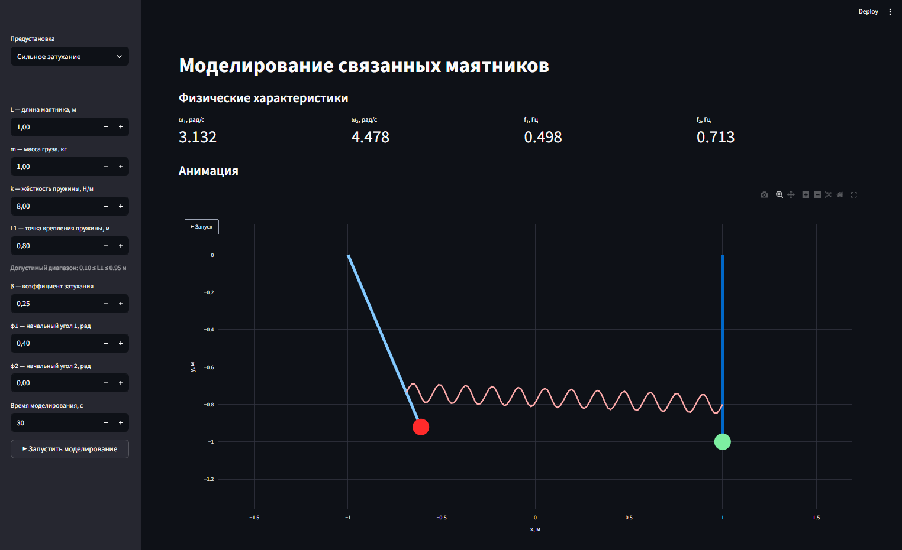
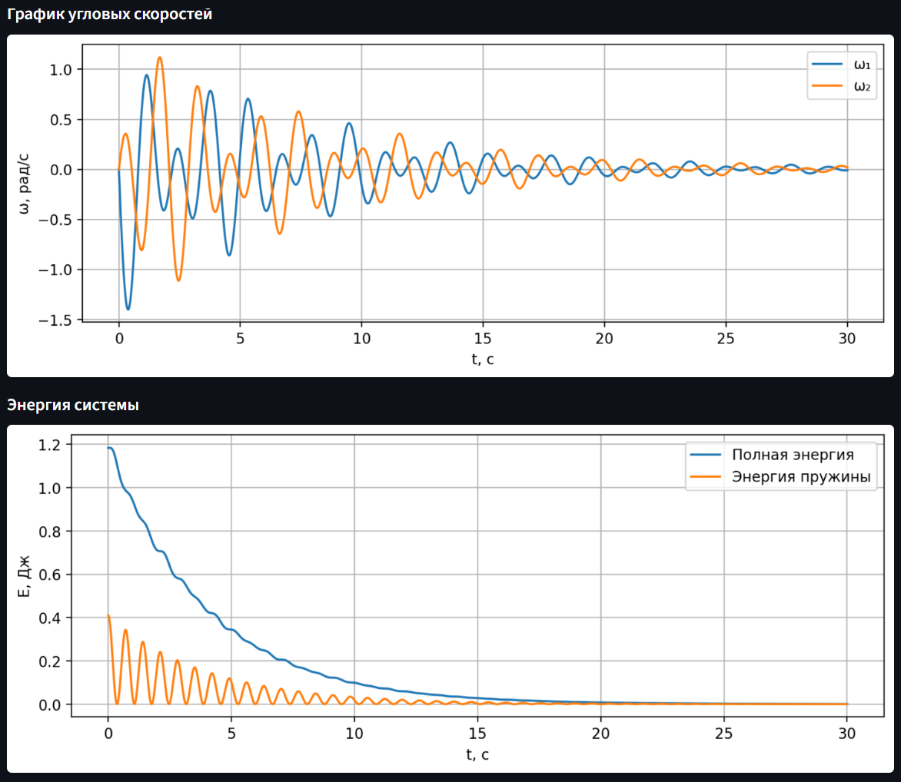

# Моделирование связанных маятников

Интерактивное приложение для моделирования системы двух связанных математических маятников.

Проект позволяет исследовать:

- нормальные режимы колебаний;
- передачу энергии между маятниками;
- влияние жёсткости пружины;
- влияние затухания;
- изменение частот системы.

Приложение реализовано на Python с использованием Streamlit и численного решения системы дифференциальных уравнений.

---

# Демонстрация

Ниже приведён пример работы приложения в режиме **«Сильное затухание»**.

В данном режиме коэффициент затухания увеличивается, что приводит к постепенному уменьшению амплитуды колебаний и снижению полной энергии системы.

### Анимация системы

<p align="center">
  
</p>

---

### Графики моделирования

На графиках показано изменение угловых скоростей и уменьшение энергии системы во времени.

<p align="center">
  
</p>

---

# Физическая модель

Рассматривается система из двух одинаковых маятников:

- длина маятника — `L`
- масса груза — `m`
- коэффициент жёсткости пружины — `k`
- расстояние до точки крепления пружины — `L1`
- коэффициент затухания — `β`

Пружина соединяет стержни маятников, а не сами грузы.

Используется приближение малых углов:

sin(φ) ≈ φ

Это позволяет описывать систему линейными уравнениями движения.

---

## Уравнения движения

Для первого маятника:

ω₁' = -βω₁ − (g/L)φ₁ − C(φ₁−φ₂)

Для второго:

ω₂' = -βω₂ − (g/L)φ₂ − C(φ₂−φ₁)

где:

C = kL₁²/(mL²)

Также используется:

φ₁' = ω₁  
φ₂' = ω₂

---

# Возможности приложения

## Анимация

Отображение движения системы в реальном времени.

Показывается:

- движение маятников;
- работа пружины;
- изменение положения во времени.

---

## Графики

В приложении автоматически строятся два графика.

### 1. График угловых скоростей

Показывает изменение угловых скоростей:

- ω₁(t) — первый маятник;
- ω₂(t) — второй маятник.

Позволяет исследовать динамику системы.

---

### 2. График энергии системы

Отображает:

- полную энергию системы;
- энергию, запасённую в пружине.

Используется для анализа затухания и обмена энергией.

---

## Анализ системы

Рассчитываются:

- синфазная угловая собственная частота ω₁ (рад/с);
- противофазная угловая собственная частота ω₂ (рад/с);
- соответствующие частоты f₁ и f₂ в Герцах.

---

# Предустановленные режимы

В приложении доступны готовые сценарии моделирования.

| Режим               | Назначение                                                                           |
| ------------------- | ------------------------------------------------------------------------------------ |
| Передача энергии    | Демонстрация постепенного обмена энергией между маятниками через связь пружиной      |
| Синфазный режим     | Оба маятника совершают колебания в одном направлении и с одинаковой фазой            |
| Противофазный режим | Маятники движутся навстречу друг другу, что приводит к более активной работе пружины |
| Сильное затухание   | Демонстрация постепенного уменьшения амплитуды вследствие потерь энергии             |

Каждый режим можно использовать как начальную конфигурацию и затем изменять параметры вручную.

# Структура проекта

```text
coupled-pendulums
│
├── app.py
├── README.md
├── requirements.txt
│
├── src
│   ├── __init__.py
│   ├── physics.py
│   ├── solver.py
│   ├── analysis.py
│   └── visualization.py
│
└── report
```

---

# Требования

- Python 3.12+
- Windows 10/11

---

# Установка

Клонировать проект:

```bash
git clone <repo-url>
```

Перейти в папку:

```bash
cd coupled-pendulums
```

Создать виртуальное окружение:

```bash
python -m venv .venv
```

Активировать:

Windows:

```bash
.venv\Scripts\activate
```

Установить зависимости:

```bash
pip install -r requirements.txt
```

---

# Запуск

```bash
streamlit run app.py
```

Приложение откроется в браузере.

---

# Используемые технологии

- Python
- Streamlit
- NumPy
- SciPy
- Matplotlib
- Plotly

---

# Автор

Загородников Евгений Геннадьевич
